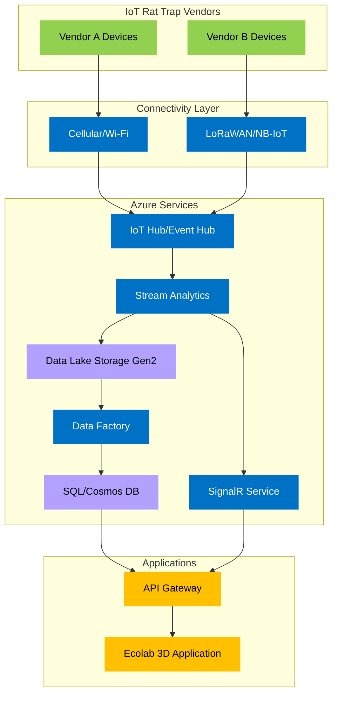

Technical Implementation Document: Ecolab 3D Integration for IoT Rat Trap Monitoring at McDonald's and Starbucks

# 1. Introduction: Project Overview and Goals

This document outlines the technical implementation plan for integrating data from IoT-enabled rat traps deployed at McDonald's and Starbucks locations into the Ecolab 3D application. The primary goal is to provide real-time and historical metrics on pest activity, enabling proactive pest management and ensuring a hygienic environment for customers. This system will leverage various Azure services to ingest, process, store, and ultimately present disparate data within the Ecolab 3D platform.

## Project Goals:

- Real-time Pest Activity Monitoring: Provide near real-time updates on trap activations and other relevant metrics (e.g., battery levels, sensor status) within the Ecolab 3D application.
- Historical Trend Analysis: Enable users to analyze historical pest activity data to identify trends, hotspots, and the effectiveness of pest management strategies over time.
- Integration of Disparate Data Sources: Support data ingestion from IoT rat traps provided by different manufacturers, potentially with varying data formats and communication protocols.
- Seamless Integration with Ecolab 3D: Ensure a smooth and intuitive integration of the rat trap data within the existing Ecolab 3D user interface, providing a unified view of pest management information.
- Scalability and Reliability: Build a system on Azure that can scale to accommodate a large number of devices and handle high volumes of data reliably.
- Robust ETL Pipeline: Implement a comprehensive Extract, Transform, Load (ETL) process to handle data ingestion, standardization, enrichment, and delivery to the Ecolab 3D application.

# 2. System Architecture



The diagram above illustrates the complete system architecture, with components color-coded for clarity:

- Green components represent IoT device vendors
- Blue components indicate Azure services
- Purple represents storage solutions
- Yellow highlights application-layer components

Each group of components serves a specific purpose in the data flow:

- IoT Rat Trap Vendors: Physical devices deployed across McDonald's and Starbucks locations
- Connectivity Layer: Various communication protocols handling device-cloud communication
- Azure Services: Core processing and transformation infrastructure
- Applications: Integration layer with the Ecolab 3D platform

## Component Descriptions:

IoT Rat Traps (Vendor A & B): These are the physical devices deployed at McDonald's and Starbucks locations that detect and potentially capture rodents. They will transmit data about their status (e.g., trap activation, battery level, sensor readings). Different vendors might use different communication protocols and data formats.

Connectivity: The rat traps will utilize various connectivity options (e.g., cellular, Wi-Fi, LoRaWAN, NB-IoT) to send data to the cloud.

Azure IoT Hub / Event Hub: These Azure services will act as the entry point for the IoT data in the cloud. IoT Hub provides device management capabilities, while Event Hub is a scalable event ingestion service. The choice between them might depend on the specific requirements of the IoT trap vendors.

Azure Stream Analytics / Azure Functions: These services will be responsible for the initial processing and standardization of the incoming data. Stream Analytics is suitable for real-time data processing, while Azure Functions can handle more complex transformations and routing.

Azure Data Lake Storage Gen2: This scalable and cost-effective data lake will serve as a central repository for storing both raw and processed data, providing an audit trail and enabling batch processing.

Azure Data Factory: This fully managed, serverless data integration service will orchestrate the ETL processes, moving and transforming data from the data lake to a data store optimized for the Ecolab 3D application.

Azure SQL Database / Azure Cosmos DB: These Azure database services will store the transformed and enriched data in a format suitable for efficient querying by the Ecolab 3D application. The choice might depend on the data model and query patterns required.

API Gateway / Custom API: An API Gateway or a custom-developed API will provide a secure and controlled interface for the Ecolab 3D application to access the processed data.

Ecolab 3D Application: This is the existing Ecolab platform where the rat trap data will be visualized and integrated with other pest management information.

Azure SignalR Service: This service will enable real-time, bidirectional communication between the backend and the Ecolab 3D application, allowing for the display of live metrics.

# 3. In-Depth ETL Discussion

## 3.1 Extraction

The extraction phase involves retrieving data from the various IoT rat trap vendors. This can occur through different mechanisms:

- Direct Device-to-Cloud Communication: Some vendors might directly send data to Azure IoT Hub or Event Hub using protocols like MQTT, AMQP, or HTTPS. In this case, the extraction is handled by the Azure ingestion service.
- Vendor-Specific APIs: Other vendors might expose their data through their own APIs. In this scenario, Azure Functions or Azure Logic Apps could be used to periodically poll these APIs and extract the data.
- File-Based Transfers: Some vendors might provide data in batch files (e.g., CSV, JSON) on a regular schedule. Azure Data Factory or Azure Functions could be used to ingest these files from sources like SFTP servers or Azure Blob Storage.

## 3.2 Transformation

The transformation phase is where the disparate data is standardized, cleaned, and enriched to be consistent and usable by the Ecolab 3D application. This involves several steps:

```json
// Example: Data from Vendor A
{
  "trapId": "MCD-123",
  "event": "trap_activated",
  "timestamp": "2025-04-03T10:00:00Z",
  "battery": 95
}

// Example: Data from Vendor B
{
  "device_serial": "SBX-456",
  "type": "capture",
  "time": "1680518400", // Unix timestamp
  "power_level": "high"
}

// Example: Standardized Schema
{
  "deviceId": "MCD-123" / "SBX-456",
  "eventType": "trap_activated" / "capture",
  "eventTimestamp": "2025-04-03T10:00:00Z" / "2025-04-03T16:00:00Z",
  "batteryLevel": 95 / 80 // Map "high" to a percentage
}
```

## 3.3 Loading

The loading phase involves writing the transformed and enriched data to the target data store(s) for consumption by the Ecolab 3D application:

- Real-time Metrics Loading: Standardized real-time metrics (e.g., trap activations) will be loaded into Azure SignalR Service for immediate display on the Ecolab 3D dashboard.
- Archived Data Loading: Transformed and enriched data intended for historical analysis will be loaded into Azure Data Lake Storage Gen2 for long-term storage and batch processing.
- Operational Data Loading: Data required for querying and display within the Ecolab 3D application will be loaded into Azure SQL Database or Azure Cosmos DB.

# 4. Data Flow for Live Metrics

For live metrics, the data flow will be optimized for low latency:

1. IoT rat traps send data to Azure IoT Hub / Event Hub.
2. Azure Stream Analytics processes the incoming data, standardizes the relevant metrics (e.g., trap activation count), and filters for real-time updates.
3. Azure Stream Analytics directly outputs the standardized live metrics to Azure SignalR Service.
4. The Ecolab 3D application, connected to Azure SignalR Service, receives and displays the live updates in near real-time.

# 5. Data Flow for Archived Data

For archived data and historical analysis, the data flow will involve batch processing:

1. IoT rat traps send data to Azure IoT Hub / Event Hub.
2. Azure Stream Analytics or Azure Functions perform initial standardization and then write the data (or a copy) to Azure Data Lake Storage Gen2 in a suitable format (e.g., Parquet for efficient querying).
3. Azure Data Factory orchestrates a pipeline that periodically reads data from Azure Data Lake Storage Gen2.
4. Within the Data Factory pipeline, data transformations and enrichment are performed using Data Flow activities or Azure Databricks.
5. The transformed and enriched data is then loaded into Azure SQL Database or Azure Cosmos DB.
6. The Ecolab 3D application queries this database via the API Gateway to retrieve historical data for analysis and visualization.

# 6. Integration with Ecolab 3D Application

Integration with the Ecolab 3D application will primarily occur through a secure API. The API Gateway will expose endpoints that the Ecolab 3D application can call to retrieve the processed rat trap data. For live metrics, the Ecolab 3D application will establish a connection with Azure SignalR Service to receive real-time updates.

## API Endpoints (Example):

```http
/api/rattraps/live: Returns the latest real-time metrics (e.g., total activations in the last hour).
/api/rattraps/historical: Accepts query parameters (e.g., date range, location) and returns historical pest activity data.
/api/rattraps/{trapId}/details: Returns detailed information about a specific rat trap.
```

# 7. Security Considerations

Security will be a paramount concern throughout the implementation:

- Device Security: Secure provisioning of IoT devices to Azure IoT Hub using Device Provisioning Service (DPS) and secure communication using TLS/SSL.
- Cloud Security: Leveraging Azure security features such as Azure Active Directory (AAD) for authentication and authorization, Azure Key Vault for managing secrets and keys, and Azure Security Center for threat detection and monitoring.
- Data Security: Encryption of data at rest (using Azure Storage Service Encryption and database encryption) and in transit (using HTTPS for API communication).
- Network Security: Use of Azure Virtual Networks (VNets) and Network Security Groups (NSGs) to isolate and secure the system components.

# 8. Scalability and Reliability

The system will be designed for scalability and reliability by leveraging the inherent capabilities of the chosen Azure services:

- Azure IoT Hub / Event Hub: Designed to handle massive numbers of devices and high data throughput.
- Azure Stream Analytics: Horizontally scalable for real-time data processing.
- Azure Data Lake Storage Gen2: Provides virtually unlimited storage capacity.
- Azure Data Factory: Serverless and scales automatically based on workload.
- Azure SQL Database / Azure Cosmos DB: Offer various scaling options to accommodate growing data volumes and query demands.
- Azure SignalR Service: Scales to handle millions of concurrent connections.

# 9. Potential Enhancements

Several opportunities exist for future enhancements:

- Predictive Analytics: Implement machine learning models to predict future pest activity based on historical data, weather patterns, and other relevant factors.
- Alerting and Notifications: Integrate with Ecolab 3D's alerting system to trigger notifications based on specific pest activity patterns.
- Integration with Mapping Services: Visualize pest activity data on a map within Ecolab 3D for better spatial understanding.

# 10. Conclusion

Integrating IoT rat trap data into the Ecolab 3D application using Azure services provides a powerful solution for proactive pest management at McDonald's and Starbucks. The robust ETL pipeline ensures that disparate data can be effectively ingested, transformed, and loaded for both real-time monitoring and historical analysis within the Ecolab 3D platform. This system will contribute to a more hygienic environment and improved operational efficiency.
